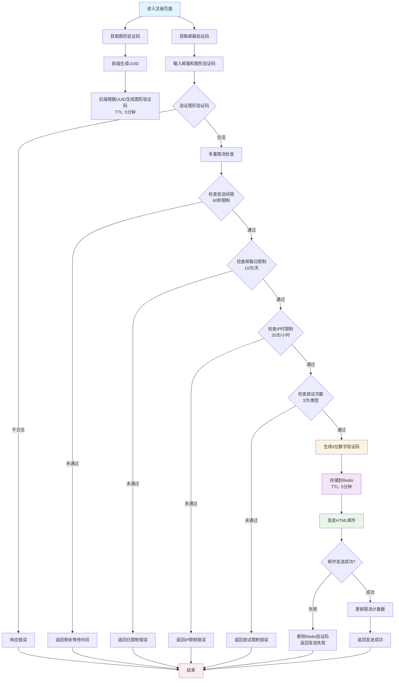
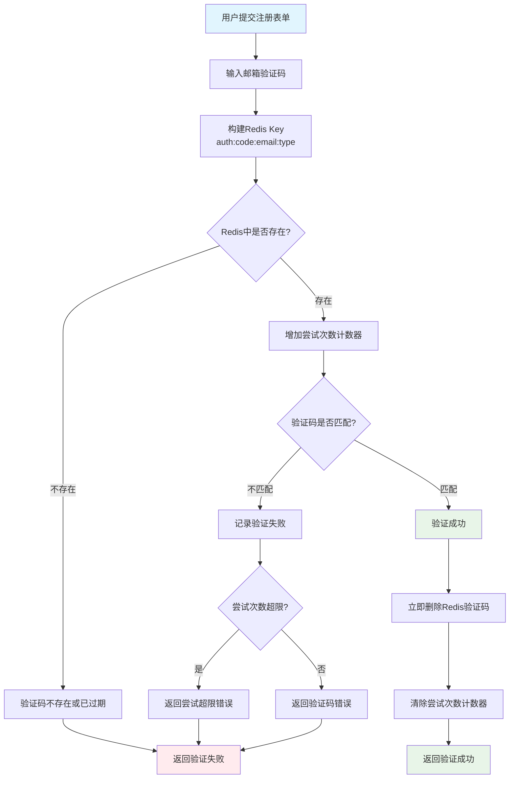
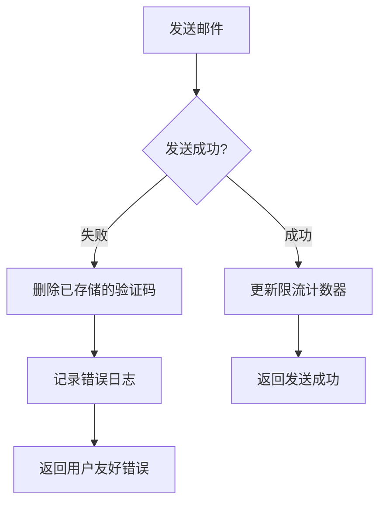

# VocaTa 验证码系统流程图

## 验证码发送流程



## 验证码验证流程



## Redis缓存键结构

```mermaid
graph LR
    A[Redis Keys] --> B[验证码存储]
    A --> C[限流控制]

    B --> B1[auth:code:email@example.com:1<br/>存储: 123456<br/>TTL: 5分钟]
    B --> B2[auth:code:email@example.com:3<br/>存储: 654321<br/>TTL: 5分钟]

    C --> C1[发送间隔限制]
    C --> C2[邮箱日限制]
    C --> C3[IP时限制]
    C --> C4[尝试次数限制]

    C1 --> C11[auth:send_limit:email@example.com<br/>存储: 1<br/>TTL: 60秒]
    C2 --> C21[auth:daily_limit:email@example.com:20240924<br/>存储: 5<br/>TTL: 24小时]
    C3 --> C31[auth:ip_limit:192.168.1.100:2024092414<br/>存储: 3<br/>TTL: 1小时]
    C4 --> C41[auth:attempt:email@example.com:1<br/>存储: 2<br/>TTL: 5分钟]

    style B fill:#e3f2fd
    style C fill:#fff3e0
```

## 多重限流机制

### 1. 发送间隔限制
- **规则**: 同一邮箱60秒内只能发送一次
- **Redis Key**: `auth:send_limit:{email}`
- **TTL**: 60秒
- **实现**: 发送时设置标记，存在时拒绝发送

### 2. 邮箱日限制
- **规则**: 同一邮箱每天最多发送10次
- **Redis Key**: `auth:daily_limit:{email}:{yyyyMMdd}`
- **TTL**: 24小时
- **实现**: 每次发送递增计数，达到上限拒绝

### 3. IP时限制
- **规则**: 同一IP每小时最多请求20次
- **Redis Key**: `auth:ip_limit:{ip}:{yyyyMMddHH}`
- **TTL**: 1小时
- **实现**: 每次请求递增计数，达到上限拒绝

### 4. 验证尝试限制
- **规则**: 同一邮箱同一类型最多尝试3次
- **Redis Key**: `auth:attempt:{email}:{type}`
- **TTL**: 5分钟
- **实现**: 每次验证失败递增，达到上限拒绝验证

## 验证码类型说明

| 类型值 | 说明 | 使用场景 |
|--------|------|----------|
| 1 | 注册验证码 | 用户注册时验证邮箱 |
| 2 | 登录验证码 | 邮箱验证码登录 |
| 3 | 重置密码验证码 | 忘记密码时重置 |
| 4 | 修改邮箱验证码 | 更换邮箱地址 |
| 5 | 敏感操作验证码 | 重要操作二次验证 |

## 安全特性

### 1. 验证码生成
- **算法**: SecureRandom生成6位数字
- **长度**: 固定6位，易于用户输入
- **随机性**: 使用加密安全的随机数生成器

### 2. 存储安全
- **位置**: Redis内存缓存，不持久化到磁盘
- **加密**: 明文存储（验证码本身无敏感性）
- **过期**: 自动过期机制，无需手动清理

### 3. 防暴力破解
- **尝试限制**: 每个验证码最多尝试3次
- **时间窗口**: 5分钟内有效
- **账户保护**: 多次失败后临时锁定

### 4. 防垃圾请求
- **频率限制**: 多维度限流控制
- **IP追踪**: 记录请求来源IP
- **异常检测**: 监控异常请求模式

## 错误处理机制

### 1. 邮件发送失败


### 2. Redis连接失败
- **降级策略**: 暂时使用数据库存储
- **重试机制**: 自动重试Redis连接
- **监控告警**: 及时发现Redis故障

### 3. 服务降级
- **熔断机制**: 邮件服务异常时熔断
- **备用方案**: 提供其他验证方式
- **用户提示**: 友好的错误提示信息

## 管理员功能

### 1. 清除验证码
```java
// 清除特定邮箱的特定类型验证码
verificationCodeService.clearCode("user@example.com", 1);
```

### 2. 清除限流
```java
// 清除邮箱的所有限流限制
verificationCodeService.clearEmailLimits("user@example.com");
```

### 3. 查询状态
```java
// 查询验证码剩余时间
Long remainingTime = verificationCodeService.getCodeRemainingTime("user@example.com", 1);

// 查询发送间隔剩余时间
Long sendRemaining = verificationCodeService.getSendRemainingTime("user@example.com");
```

## 监控指标

### 1. 业务指标
- 验证码发送成功率
- 验证码验证成功率
- 平均验证时间
- 用户转化率

### 2. 性能指标
- 发送接口响应时间
- 验证接口响应时间
- Redis操作耗时
- 邮件发送耗时

### 3. 安全指标
- 恶意请求数量
- 验证失败率
- IP黑名单命中
- 异常访问模式

## 配置参数

| 参数 | 默认值 | 说明 |
|------|--------|------|
| CODE_EXPIRE_MINUTES | 5 | 验证码过期时间(分钟) |
| SEND_INTERVAL_SECONDS | 60 | 发送间隔(秒) |
| MAX_ATTEMPTS | 3 | 最大尝试次数 |
| EMAIL_DAILY_LIMIT | 10 | 邮箱每日限制 |
| IP_HOURLY_LIMIT | 20 | IP每小时限制 |
| CODE_LENGTH | 6 | 验证码长度 |

这些参数可以通过配置文件进行调整，以适应不同的业务需求和安全要求。